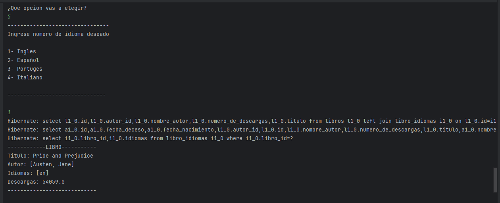

<h1 align="center">literalura</h1>

<p align="center">
  
</p>

---

## Índice

1. [Descripción del Proyecto](#descripción-del-proyecto)
2. [Tecnologías Utilizadas](#tecnologías-utilizadas)
3. [Dependencias](#dependencias)
4. [Instalación](#instalación)
5. [Uso](#uso)
6. [Licencia](#licencia)
---

## Descripción del Proyecto

literalura es una aplicación desarrollada en Java y Spring Boot que utiliza la API de Gutendex para consumir datos de libros y almacenarlos en una base de datos PostgreSQL. Esta aplicación permite gestionar información bibliográfica, realizar consultas y almacenar registros de libros de manera eficiente y segura.

---

## Tecnologías Utilizadas

- Java
- Spring Boot
- PostgreSQL

---

## Dependencias

Este proyecto hace uso de las siguientes dependencias:

- Spring Data JPA
- Jackson (para la serialización y deserialización de datos)
- Driver PostgreSQL JDBC

---

## Instalación

Para ejecutar el proyecto localmente, sigue estos pasos:

1. Clona el repositorio desde GitHub:

   ```bash
   git clone https://github.com/tu_usuario/tu_repositorio.git

---
## Uso

Paso a paso de el menu de la aplicacion:

1. Menú e inicio de la opcion 1:


2. Resultado de la opcion 2:


3. Resultado de la opcion 3:


4. Resultado de la opcion 4:


5. Resultado de la opcion 5:



## Licencia

Este proyecto está licenciado bajo la Licencia MIT.

## Creditos

Este proyecto fue desarrollado por Alejandro Herrera.
